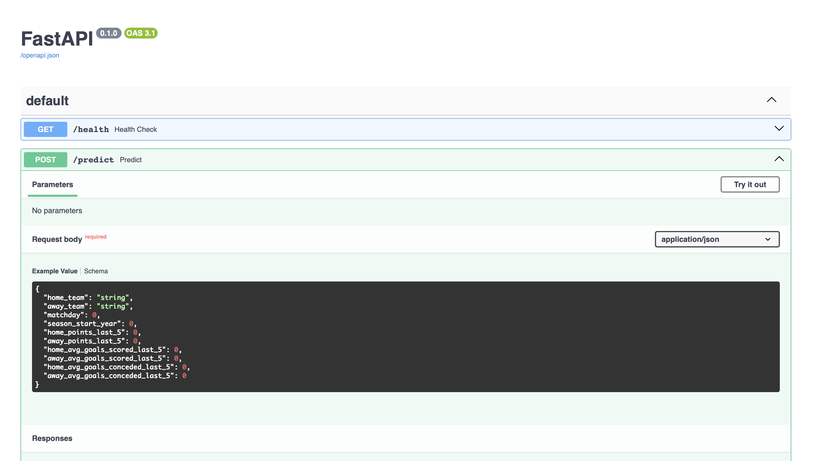

# Football Match Winner Prediction

Machine Learning project for predicting football match outcomes using historical La Liga data. The project includes feature engineering, model training, a FastAPI prediction service, and Docker deployment.



## Overview

This project aims to predict the outcome of football matches in La Liga (Home Win, Draw, or Away Win) using historical match data and machine learning techniques.

The main goal of the project was not to achieve the highest possible accuracy, but to learn and apply the complete Machine Learning workflow in a real-world scenario, including:

* Data Exploration
* Feature Engineering
* Model Training
* Model Evaluation
* Model Persistence
* API Development with FastAPI
* Dockerization

---

## Dataset

The dataset contains historical La Liga matches with information such as:

* Match date
* Home team
* Away team
* Home goals
* Away goals
* Match outcome

Based on this data, several additional features were engineered to represent each team's recent performance.

---

## Feature Engineering

The following features were created to capture team form and performance before each match.

### Recent Form

* `home_points_last_5`
* `away_points_last_5`

Total points earned by each team in their previous 5 matches within the same season.

### Offensive Performance

* `home_avg_goals_scored_last_5`
* `away_avg_goals_scored_last_5`

Average goals scored during the last 5 matches.

### Defensive Performance

* `home_avg_goals_conceded_last_5`
* `away_avg_goals_conceded_last_5`

Average goals conceded during the last 5 matches.

---

## Models Evaluated

### Logistic Regression

Used as the primary baseline model throughout the project.

### Random Forest

Tested and compared against Logistic Regression.

---

## Experiments

Several experiments were conducted to improve model performance.

### Additional Features

The following features were tested:

* Recent goal difference
* Recent points difference

These features did not improve model performance.

### Feature Scaling

Numerical features were scaled using `StandardScaler`.

Results were slightly worse than the original configuration.

### Model Comparison

Random Forest was evaluated but produced lower performance than Logistic Regression.

### Temporal Validation

In addition to a random train-test split, a temporal split was performed by training on older seasons and testing on future matches.

Results remained similar, suggesting that the model generalizes reasonably well over time.

---

## Results

Best performing model:

* Logistic Regression
* One-Hot Encoding for team names
* Recent form and scoring/conceding statistics

Approximate metrics:

* Accuracy: ~50%
* Baseline (always predicting Home Win): ~45%

Although the improvement over the baseline is modest, the project successfully demonstrates the complete machine learning workflow.

---

## Project Structure

```text
football_ml_api/

├── data/
│   ├── raw/
│   └── processed/
│
├── models/
│
├── notebooks/
│   ├── 01_eda.ipynb
│   ├── 02_feature_engineering.ipynb
│   └── 03_model_training.ipynb
│
├── src/
│   ├── api/
│   ├── inference/
│   └── training/
│
├── Dockerfile
├── requirements.txt
└── README.md
```

---

## API

The application exposes a REST API using FastAPI.

### Health Check

```http
GET /health
```

### Prediction Endpoint

```http
POST /predict
```

Example request:

```json
{
  "home_team": "FC Barcelona",
  "away_team": "Sevilla FC",
  "matchday": 38,
  "season_start_year": 2025,
  "home_points_last_5": 10,
  "away_points_last_5": 7,
  "home_avg_goals_scored_last_5": 1.8,
  "away_avg_goals_scored_last_5": 1.2,
  "home_avg_goals_conceded_last_5": 0.8,
  "away_avg_goals_conceded_last_5": 1.4
}
```

Example response:

```json
{
  "predicted_winner": "HOME_TEAM"
}
```

---

## Docker

Build the Docker image:

```bash
docker build -t football-ml-api .
```

Run the container:

```bash
docker run -p 8000:8000 football-ml-api
```

Swagger UI:

```text
http://localhost:8000/docs
```

---

## Technologies Used

* Python
* Pandas
* Scikit-Learn
* FastAPI
* Pydantic
* Docker
* Joblib
* Uvicorn

---

## Key Learnings

Throughout this project, the following concepts were explored:

* Exploratory Data Analysis (EDA)
* Feature Engineering
* Data Leakage Prevention
* One-Hot Encoding
* Machine Learning Pipelines
* Logistic Regression
* Random Forest
* Model Evaluation Metrics
* Temporal Validation
* REST API Development
* Dockerization
* Logging

One of the most important lessons learned was that improving model performance often depends more on data quality and feature engineering than on simply choosing a more complex algorithm.

---

## Future Improvements

Possible future enhancements include:

* Incorporating ELO ratings
* Adding league standings information
* Testing gradient boosting models (XGBoost, LightGBM)
* Implementing automated tests
* CI/CD integration
* Cloud deployment
* Model monitoring and tracking
